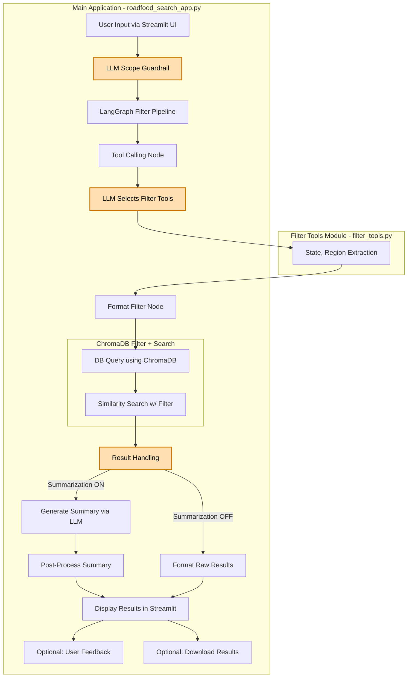

# Roadfood Advisor

A Streamlit application that allows users to search for restaurants from the Roadfood guide (10th edition) and generate summary articles using OpenAI's language models.

Live demo: https://rfadvisr.us

## Features

- Search for restaurants based on cuisine, location, or other criteria
- Generate summary articles using different prompt types and models
- Compare results from base and fine-tuned models
- Download search results and summaries

## Project Structure

- `rfadvisr_app.py`: The main Streamlit application
- `modal_app.py`: Modal deployment configuration
- `prompts/`: Directory containing prompt templates
- `data/`: Directory containing the Chroma vector database and other data files
- `chroma_rf10th/`: Chroma vector database for the 10th edition

## Notes

- The app uses a fine-tuned GPT-3.5 model for specialized Roadfood summaries
- The Chroma database contains vector embeddings of restaurant descriptions for RAG purposes
- The app is configured to work both locally and in the Modal cloud environment

## Application Flow Diagram

