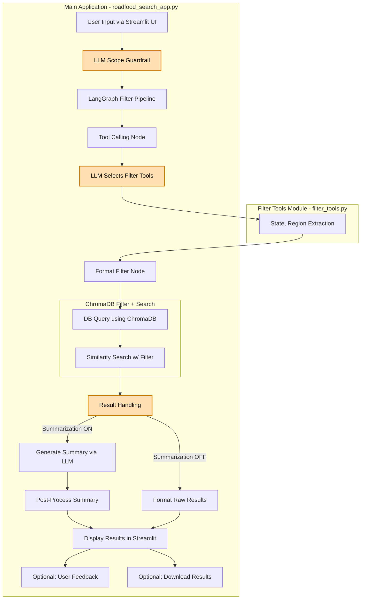

# Roadfood Advisor

An AI-powered restaurant discovery app that helps travelers find authentic local eateries from Jane and Michael Stern's *Roadfood* guide (10th edition) using natural language queries.

Live demo: https://rfadvisr.us

## Features

- **Natural Language Search**: Ask questions like "great BBQ between Austin and Houston" or "classic diners in New England"
- **Hybrid RAG Architecture**: Combines LLM-parsed structured filters with semantic search on restaurant descriptions
- **Intelligent Query Routing**: LLM identifies search patterns and routes to specialized tools for location, cuisine, and restaurant type filtering
- **Automatic Travelogue Generation**: Creates personalized narratives highlighting what makes each recommended restaurant special
- **Guardrail System**: Ensures queries stay focused on restaurant and food-related searches
- **Download Options**: Save search results and generated summaries

## Project Structure

- `roadfood_search_app.py`: Main Streamlit application
- `filter_tools.py`: LangChain tools for query parsing and filtering
- `modal_app.py`: Modal deployment configuration
- `prompts/`: Directory containing prompt templates
  - `tool_calling_prompt.txt`: System prompt for LLM tool selection
  - `advanced_summary_prompt.txt`: Template for travelogue generation
  - `guardrail_prompt.txt`: Scope validation prompt
- `data/chroma_rf10th/`: ChromaDB vector database containing 1,000+ restaurant embeddings

## Technology Stack

- **LangChain/LangGraph**: Orchestration and tool calling
- **ChromaDB**: Vector database for semantic search
- **OpenAI**: GPT-3.5-turbo for language processing and content generation
- **Streamlit**: Web application framework
- **Modal**: Cloud deployment platform
- **LangSmith**: Observability and feedback collection

## Application Flow Diagram

